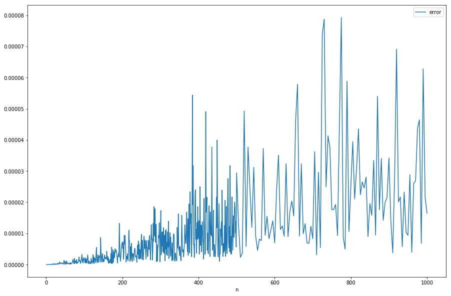
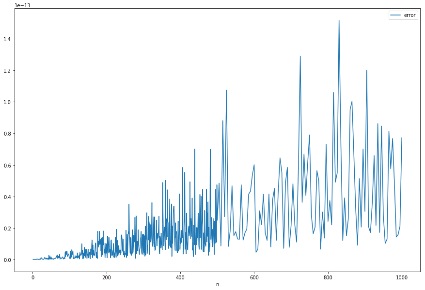
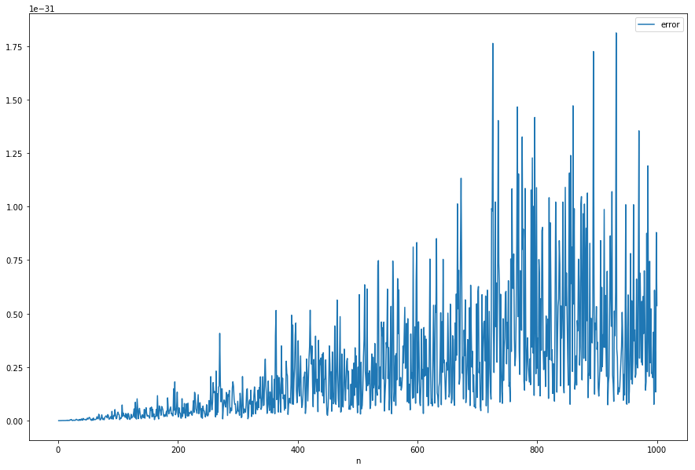

# Building
## Prerequisites

Installed `ifort` or `gfortran` compiler.

## Compilation

The program can be compiled using provided Makefile.
The default action for `make` is to use ifort compiler creating
executable `out/main`. 

Command `make out/gmain` can be used
for compilation with gfortran. Note that you may need to issue `make clean`
before switching compilers.

## `kind` adjustemnt


`kind` value used for floating point variables can be changed by modifying Makefile variable `KIND`, as in
```
make clean
make all KIND=8
```

# Results

## Calu

## Accuracy

Accuracy of calculated results was measured by comparing them to the expected result expressed as `f(x) = x`.
Averages of absolute differences between calculated and expected value are stored in files `result/accuracy.k{4,8,16}.dat`.  
Each of these files consists of columns expressing used `kind`, number of divisions `n` and the average `error`.

Graphs of the relation error(n) were generated using python pandas and matplotlib. Note the errors magnitues presented in top-left corners of the images.

### kind=4
Error was calculated for each n in `1..499` and for every fifth n in `500..1000`, hence the change in graph density.


### kind=8
Error was calculated for each n in `1..499` and for every fifth n in `500..1000`.


### kind=16
Error was calculated for each n in `1..1000`.


